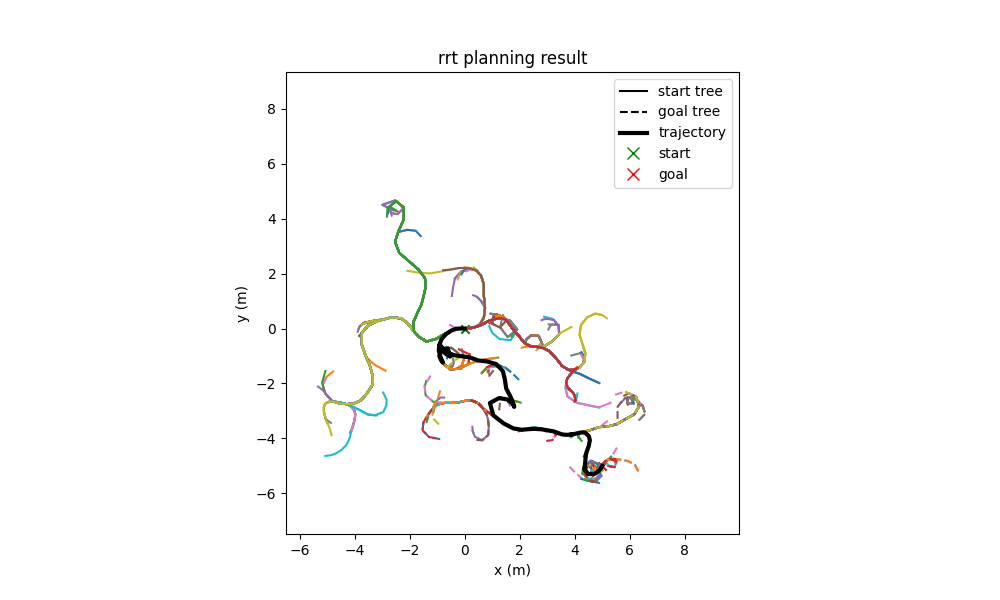

# rrt-plot
Plotting test results for the [rapidly exploring random tree](https://github.com/AlexGisi/rrt) implementation.



## Use
Create a `config.yaml` file in the root directory like this:

```
dubins_paths_test:
  binary_path: "/my/path/to/dubins_paths_test"
dubins_random_test:
  binary_path: "/my/path/to/dubins_random_test"
plan_with_obstacles_test:
  binary_path: "/my/path/to/plan_with_obstacles_test"
plan_without_obstacles_test:
  binary_path: "/my/path/to/plan_without_obstacles_test"
```

The entries correspond to the test binaries generated by the [rrt](https://github.com/AlexGisi/rrt) `cmakelists.txt`.

Then run the script `plot_test.py` with the `--name` argument corresponding to which test to run. For example, `python3 rrt_plot/plot_test.py --name dubins_paths_test`.

## Examples
Paths from the dubins car model, with an obstacle:


Planning tree generated with an obstacle in the environment:

